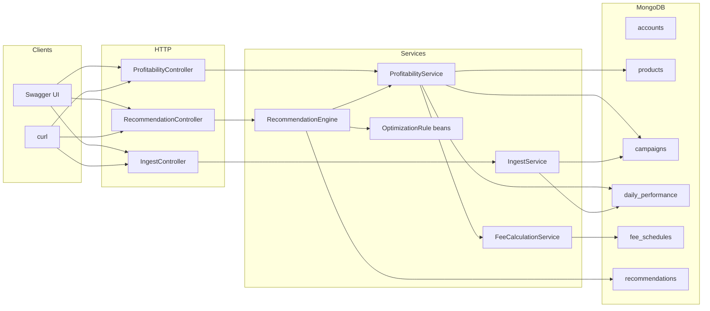

# TrueTake

A Spring Boot REST API for **true campaign profitability** in Amazon-style retail media: profit after COGS, referral fees, FBA fulfillment, and returns, then bid recommendations from those numbers.

Typical ad dashboards stop at ACOS/ROAS. TrueTake treats **ACOS as not the P&L**.

## What I built

Sellers and agencies live in two dashboards that rarely meet:

- **Ads:** impressions, clicks, spend, ACOS, ROAS
- **Ops:** COGS, marketplace fees, FBA pick/pack, returns, inventory

A campaign can look healthy on ROAS and still lose money once take-rates hit. This API joins those worlds for a given campaign and day, then a **rules engine** says pause, cut the bid, or raise it, with a written reason.

**Endpoints**

| Method | Path | Purpose |
| --- | --- | --- |
| GET | `/api/profitability/campaign/{campaignId}` | One campaign / one day, full P&L breakdown |
| GET | `/api/profitability/account/{accountId}` | Roll-up across campaigns (optional date range) |
| POST | `/api/recommendations/run/{accountId}` | Run the bid rules now (demo stand-in for the nightly job) |
| GET | `/api/recommendations/account/{accountId}` | List saved recommendations + reasoning |
| POST | `/api/ingest/performance` | Bulk upsert extra daily ad rows |

No auth by design. This is a demo API, not a production SaaS.

## Why this is different (and when it is better)

Typical seller tools stop at **ad efficiency**:

```
ACOS = adSpend / revenue
ROAS = revenue / adSpend
```

Those ignore the cost of actually selling the unit. This engine uses:

```
trueProfit = revenue
           - (cogs × unitsSold)
           - referralFee          # category % of revenue
           - fbaFee               # per-unit FBA × unitsSold
           - (revenue × returnsRate)
           - adSpend
```

Then:

- `profitMargin = trueProfit / revenue`
- `profitPerClick = trueProfit / clicks`

ACOS is still returned so you can **see the gap**: a campaign can have a tolerable ACOS and a negative true profit.

Rules are not “if ACOS > 30% pause.” They use the same true-profit snapshot:

| Rule | Signal | Action |
| --- | --- | --- |
| `LowProfitRule` | Profit per click &lt; 0 | `LOWER_BID`, or `PAUSE` if margin &lt; −20% |
| `LowInventoryRule` | Days of cover &lt; 7 | `PAUSE` (don’t advertise into a stockout) |
| `HighPerformerRule` | Margin ≥ 20% and profit/click ≥ $0.50 | `RAISE_BID` |

**Out of scope:** live Amazon Ads APIs, writing bids back to Sponsored Products, and multi-tenant auth. The focus is **correct money math and clear architecture**.

## System design principles

| Principle | How it shows up |
| --- | --- |
| Layered architecture | Controller → service → repository. HTTP never talks to Mongo. |
| Persistence vs API | `@Document` entities stay in Mongo. Responses are DTOs / Java records. |
| Strategy pattern | `OptimizationRule` + three `@Component` implementations. Spring injects `List<OptimizationRule>`. Add a rule without editing the engine. |
| Single responsibility | `FeeCalculationService` = marketplace fees. `ProfitabilityService` = P&L. `RecommendationEngine` = iterate rules and save. |
| Document model (Mongo) | No joins. Sequential lookups: campaign → performance → product → fee schedule by category. |
| Money integrity | `BigDecimal` everywhere. `MoneyMath` scales money to 2 dp, ratios to 4. Mongo stores money as **Decimal128**, not `double`. |
| Indexes for access paths | Compound unique index on `daily_performance (campaignId, date)`. Unique fee schedule by category. |
| Fail clearly | `@ControllerAdvice` → consistent `{ timestamp, status, error, message, path }` with 400 / 404 / 422 / 500. |
| Validate at the edge | Bean Validation on ingest (`@Valid`, `@NotNull`, `@DecimalMin`). |
| Idempotent re-runs | Running recommendations for an account/day deletes that day’s prior recs, then inserts fresh ones. |
| Scheduled vs interactive | `@Scheduled` cron at 02:00 *and* `POST /recommendations/run/{accountId}` so a demo does not wait overnight. |
| Test the core, mock I/O | JUnit 5 + Mockito on formula and rules. No embedded Mongo in unit tests. |
| Secrets stay local | Atlas URI lives in gitignored `application-local.yml`. Committed `application.yml` only has placeholders. |

## How data flows



**Profitability (GET campaign)**

1. Load campaign by id.
2. Load that day’s `DailyPerformance` (or latest day if `date` is omitted).
3. Load product (COGS, weight, inventory, category).
4. Load `FeeSchedule` by category → referral % + FBA tier.
5. Apply the formula → `ProfitabilityResponse` JSON.

**Recommendations (POST run)**

1. Same snapshot per campaign for the target date.
2. Each rule returns `Optional<Recommendation>`.
3. Hits are saved with `ruleTriggered`, `action`, and `reasoning` (the sentence in Swagger is this string, filled with computed numbers, not hardcoded).

**Ingest (POST performance)**

JSON array → validate → upsert on `(campaignId, date)` if the campaign exists.

## Dummy / seed data

There is **no live ads API**. On first boot, `DataSeeder` (`CommandLineRunner`) writes to Mongo **only if `accounts` is empty**.

| Collection | What’s in it | Real or fake? |
| --- | --- | --- |
| `accounts` | Lumina Beauty Co (brand), Northstar Retail Media (agency) | Invented |
| `products` / `campaigns` | 10 SKUs, 10 Sponsored Products campaigns, realistic COGS and weights | Invented |
| `daily_performance` | 28 days per campaign: impressions, clicks, spend, units, revenue, returns | Invented, with a seeded `Random(42)` so numbers are repeatable but noisy |
| `fee_schedules` | Beauty / Health / Home referral % and FBA $ by ounce | **Based on published US Amazon Seller Central rates (2026).** Beauty/Health 15% above $10; Home 15%; FBA small/large standard, non-peak, **$10-$50 price band** (not the 3.5% fuel surcharge) |

Seed is **biased on purpose** so the rules have something to catch:

- Winners: `camp-serum`, `camp-magnesium`
- Losers after fees: `camp-collagen`, `camp-cutting-board`, `camp-sheets`
- Thin inventory: `camp-toner` (15 units), `camp-omega` (35 units)

Stable IDs live in `DemoIds` (`acc-lumina`, `camp-serum`, …) so Swagger dropdowns and curls stay readable.

To regenerate seed data, drop the configured database (default name is in `application.yml`) and restart:

```bash
mongosh adbrew_engine --eval "db.dropDatabase()"
```

## File structure

```
TrueTake/
├── pom.xml                          # Spring Boot 3.3.13, Java 21, Mongo, Springdoc, Lombok
├── mvnw / mvnw.cmd                  # Maven wrapper (no global mvn required)
├── README.md
└── src/
    ├── main/java/com/adbrew/engine/
    │   ├── *Application.java        # Spring Boot entry point
    │   ├── config/                  # Mongo Decimal128 converters, OpenAPI + Swagger dropdowns
    │   ├── controller/              # HTTP: profitability, recommendations, ingest
    │   ├── domain/                  # @Document collections + enums
    │   ├── dto/request|response/    # API contracts (never expose documents)
    │   ├── exception/               # 404 / 422 + global handler
    │   ├── job/                     # NightlyOptimizationJob (@Scheduled)
    │   ├── repository/              # Spring Data Mongo
    │   ├── seed/                    # DataSeeder, DemoIds
    │   ├── service/                 # Profitability, fees, ingest, recommendation engine
    │   │   └── rule/                # OptimizationRule + LowProfit / LowInventory / HighPerformer
    │   └── util/                    # MoneyMath
    ├── main/resources/
    │   ├── application.yml          # Safe to commit (env placeholders)
    │   └── application-local.yml    # Gitignored Atlas URI (not in the repo)
    └── test/java/...                # Formula + rule unit tests (mocked repos)
```

## How Swagger is used

[Springdoc OpenAPI](https://springdoc.org/) (`springdoc-openapi-starter-webmvc-ui`) generates the spec from controllers and DTOs.

| Piece | Role |
| --- | --- |
| UI | [http://localhost:8080/swagger-ui.html](http://localhost:8080/swagger-ui.html) |
| Raw spec | [http://localhost:8080/v3/api-docs](http://localhost:8080/v3/api-docs) |
| `OpenApiConfig` | Title, description, and **enum lists** on `accountId` / `campaignId` so Try-it-out is a **dropdown**, not a blank box |
| `@Operation` / `@Parameter` | Short summaries so a reviewer can demo without reading Java |
| `@Schema` on ingest | Campaign id enum + validation constraints visible in the UI |

**Demo path in Swagger**

1. GET `/api/profitability/campaign/{campaignId}` → pick `camp-collagen` (true profit negative after fees).
2. Same endpoint → `camp-serum` (positive margin).
3. POST `/api/recommendations/run/{accountId}` → pick `acc-lumina` → Execute.
4. GET `/api/recommendations/account/{accountId}` → read `reasoning` (those decimals are the live formula, interpolated into the rule’s sentence).

Leave optional `date` empty to use the latest seeded day.

## Prerequisites

- Java 21+ (`JAVA_HOME` set, `java` on PATH)
- Maven 3.9+ **or** the included wrapper (`mvnw` / `mvnw.cmd`)
- MongoDB: local instance at `mongodb://localhost:27017`, **or** Atlas via gitignored `application-local.yml` / `MONGODB_URI`

## Run

If Maven is on your PATH:

```bash
mvn spring-boot:run
```

Windows without `mvn` (IntelliJ JBR works):

```powershell
$env:JAVA_HOME = "C:\Program Files\JetBrains\IntelliJ IDEA 2026.1.3\jbr"
$env:Path = "$env:JAVA_HOME\bin;" + $env:Path
.\mvnw.cmd spring-boot:run
```

Or run the Spring Boot main class from IntelliJ.

Swagger: [http://localhost:8080/swagger-ui.html](http://localhost:8080/swagger-ui.html)

`localhost` is only reachable on this machine. To show someone else: share this repo, a hosted URL, a screen recording of Swagger, or a live call. Do not send `http://localhost:8080` as a link.

## Seeded IDs

| Kind | Id | Notes |
| --- | --- | --- |
| Brand account | `acc-lumina` | Lumina Beauty Co |
| Agency account | `acc-northstar` | Northstar Retail Media |
| High performer | `camp-magnesium`, `camp-serum` | Strong true-profit margin |
| Unprofitable after fees | `camp-collagen`, `camp-cutting-board`, `camp-sheets` | Thin contribution + high spend |
| Low inventory | `camp-toner` (15 units), `camp-omega` (35 units) | Days of cover &lt; 7 |

## Example curl

```bash
curl "http://localhost:8080/api/profitability/account/acc-lumina"
curl "http://localhost:8080/api/profitability/campaign/camp-collagen"
curl -X POST "http://localhost:8080/api/recommendations/run/acc-lumina"
curl "http://localhost:8080/api/recommendations/account/acc-lumina"
curl -X POST "http://localhost:8080/api/ingest/performance" -H "Content-Type: application/json" -d "[{\"campaignId\":\"camp-serum\",\"date\":\"2026-09-01\",\"impressions\":8000,\"clicks\":320,\"adSpend\":272.00,\"unitsSold\":28,\"revenue\":699.72,\"returnsRate\":0.04}]"
```

## Tests

Unit tests mock Mongo repositories (no database required):

```bash
.\mvnw.cmd test
```
